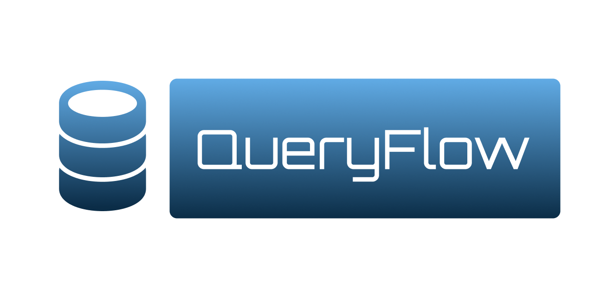
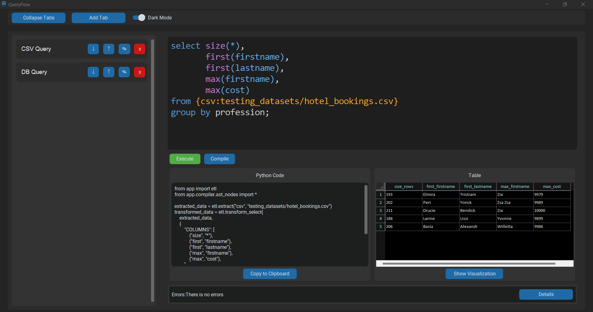
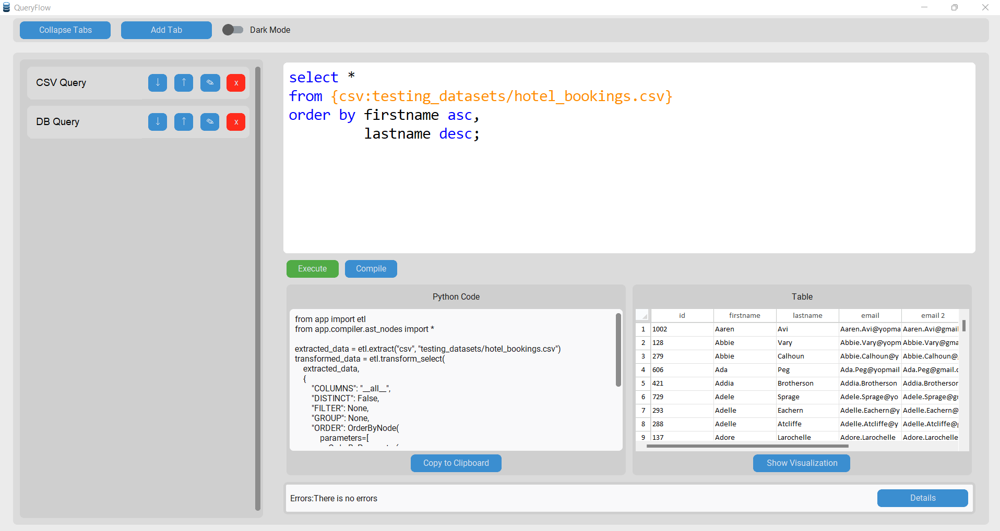
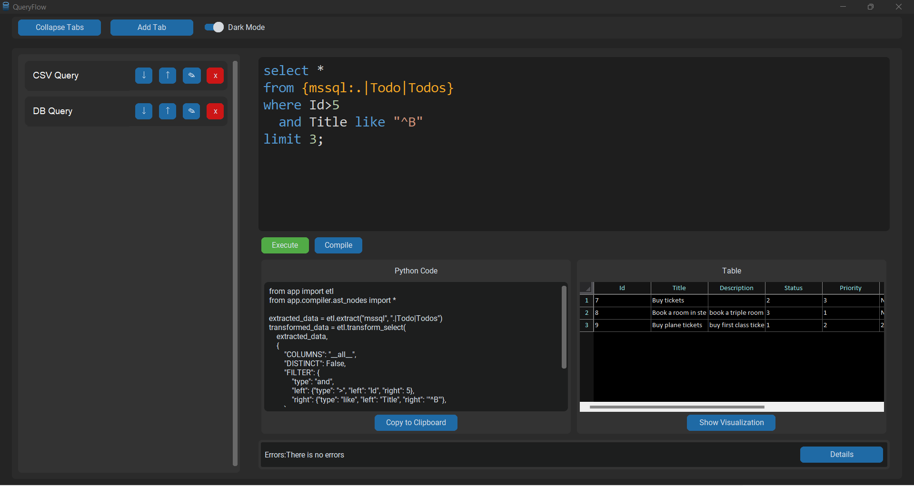
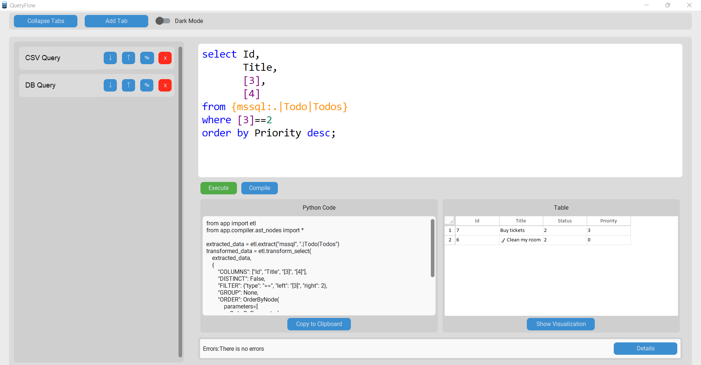

<p align="center">
    
</p>
<p align="center">
  <a href="https://github.com/FCI-Suez-2021-2025/QueryFlow/blob/fix/optimization/LICENSE">
    	
  </a>
	
	
	
</p>
<p align="center"><!-- default option, no dependency badges. -->
</p>
<p align="center">
	<!-- default option, no dependency badges. -->
</p>
<br>

##  Table of Contents

- [ Overview](#overview)
- [ Features](#features)
- [ Built With](#built-with)
- [ Project Structure](#project-structure)
  - [ Project Index](#project-index)
- [ Getting Started](#getting-started)
  - [ Prerequisites](#prerequisites)
  - [ Installation](#installation)
  - [ Usage](#usage)
- [ License](#license)

---

##  Overview

**_QueryFlow_** is a lightweight and user-friendly transpiler designed to simplify working with data.

It helps users manage, execute, and visualize queries efficiently, making it easier to gain insights from various data sources using SQL Syntax.

---

##  Features

- **Data Manipulation**: Using SQL Select operation
  - **Local**:
    - **Databases**:
        - **SQLite**
        - **MSSQL**
    - **Flat Files**:
      - **CSV**
      - **JSON**
      - **XML**
      - **Excel**
      - **HTML**
  - **Remote**:
    - **Google Earth Engine (GEE)**
    

- **GUI**:
  - **Themes**:
    - **Dark Mode**
    - **Light Mode**
  - **Tabs**: Can be used to navigate between different Queries written by the user.
    - **Content**:
      - **SQL Text Box**: A text box for writing SQL queries.
        - **Highlighting & formatting**: Syntax highlighting and formatting for the  written SQL queries.
      - **Python Code Text Box**:Displaying the Translated written SQL query into Python code and the user can edit the generated Python code.
      - **Table View**: Shows the result of the query in a tabular format.
      
      
- **Visualization**: Using Pandas, Matplotlib and Seaborn to visualize data.

---

##  Built With

- **CustomTkinter**: For creating a modern and responsive user interface.
- **Ply**: For parsing and interpreting query syntax.  
- **TkSheet**: For displaying tabular data in an interactive spreadsheet format.  
- **Pandas**: For data manipulation and analysis.  
- **SQLAlchemy**: For database interaction and management.  
- **sqlparse**: For parsing and formatting SQL queries.  
- **Google Earth Engine (GEE)**: For integrating geospatial data analysis capabilities.

---

##  Gallery

### CSV Example 1


### CSV Example 2


### DB Example 1


### DB Example 2


---

##  Project Structure

```sh
└── QueryFlow/
    ├── LICENSE
    ├── app
    │   ├── __init__.py
    │   ├── compiler
    │   ├── core
    │   ├── cv
    │   ├── etl
    │   ├── gui
    │   └── utility.py
    ├── main.py
    ├── requirements.txt
    └── testing_datasets
        └── hotel_bookings.csv
```


###  Project Index
<details open>
	<summary><b><code>QueryFlow/</code></b></summary>
	<details> <!-- __root__ Submodule -->
		<summary><b>__root__</b></summary>
		<blockquote>
			<table>
			<tr>
				<td><b><a href='https://github.com/FCI-Suez-2021-2025/QueryFlow/blob/master/main.py'>main.py</a></b></td>
			</tr>
			<tr>
				<td><b><a href='https://github.com/FCI-Suez-2021-2025/QueryFlow/blob/master/requirements.txt'>requirements.txt</a></b></td>
			</tr>
			</table>
		</blockquote>
	</details>
	<details> <!-- app Submodule -->
		<summary><b>app</b></summary>
		<blockquote>
			<table>
			<tr>
				<td><b><a href='https://github.com/FCI-Suez-2021-2025/QueryFlow/blob/master/app/utility.py'>utility.py</a></b></td>
			</tr>
			</table>
			<details>
				<summary><b>core</b></summary>
				<blockquote>
					<table>
					<tr>
						<td><b><a href='https://github.com/FCI-Suez-2021-2025/QueryFlow/blob/master/app/core/errors.py'>errors.py</a></b></td>
					</tr>
					<tr>
						<td><b><a href='https://github.com/FCI-Suez-2021-2025/QueryFlow/blob/master/app/core/result_monad.py'>result_monad.py</a></b></td>
					</tr>
					</table>
				</blockquote>
			</details>
			<details>
				<summary><b>etl</b></summary>
				<blockquote>
					<table>
					<tr>
						<td><b><a href='https://github.com/FCI-Suez-2021-2025/QueryFlow/blob/master/app/etl/controllers.py'>controllers.py</a></b></td>
					</tr>
					<tr>
						<td><b><a href='https://github.com/FCI-Suez-2021-2025/QueryFlow/blob/master/app/etl/helpers.py'>helpers.py</a></b></td>
					</tr>
					<tr>
						<td><b><a href='https://github.com/FCI-Suez-2021-2025/QueryFlow/blob/master/app/etl/core.py'>core.py</a></b></td>
					</tr>
					</table>
				</blockquote>
			</details>
			<details>
				<summary><b>cv</b></summary>
				<blockquote>
					<table>
					<tr>
						<td><b><a href='https://github.com/FCI-Suez-2021-2025/QueryFlow/blob/master/app/cv/video_reader.py'>video_reader.py</a></b></td>
					</tr>
					<tr>
						<td><b><a href='https://github.com/FCI-Suez-2021-2025/QueryFlow/blob/master/app/cv/details_extractor.py'>details_extractor.py</a></b></td>
					</tr>
					<tr>
						<td><b><a href='https://github.com/FCI-Suez-2021-2025/QueryFlow/blob/master/app/cv/detector.py'>detector.py</a></b></td>
					</tr>
					<tr>
						<td><b><a href='https://github.com/FCI-Suez-2021-2025/QueryFlow/blob/master/app/cv/operation_main.py'>operation_main.py</a></b></td>
					</tr>
					<tr>
						<td><b><a href='https://github.com/FCI-Suez-2021-2025/QueryFlow/blob/master/app/cv/threading_main.py'>threading_main.py</a></b></td>
					</tr>
					<tr>
						<td><b><a href='https://github.com/FCI-Suez-2021-2025/QueryFlow/blob/master/app/cv/bird_move.py'>bird_move.py</a></b></td>
					</tr>
					<tr>
						<td><b><a href='https://github.com/FCI-Suez-2021-2025/QueryFlow/blob/master/app/cv/bird.py'>bird.py</a></b></td>
					</tr>
					<tr>
						<td><b><a href='https://github.com/FCI-Suez-2021-2025/QueryFlow/blob/master/app/cv/folder_reader.py'>folder_reader.py</a></b></td>
					</tr>
					</table>
				</blockquote>
			</details>
			<details>
				<summary><b>gui</b></summary>
				<blockquote>
					<table>
					<tr>
						<td><b><a href='https://github.com/FCI-Suez-2021-2025/QueryFlow/blob/master/app/gui/ui_compiler.py'>ui_compiler.py</a></b></td>
					</tr>
					</table>
					<details>
						<summary><b>error_frame</b></summary>
						<blockquote>
							<table>
							<tr>
								<td><b><a href='https://github.com/FCI-Suez-2021-2025/QueryFlow/blob/master/app/gui/error_frame/error_details_popup.py'>error_details_popup.py</a></b></td>
							</tr>
							<tr>
								<td><b><a href='https://github.com/FCI-Suez-2021-2025/QueryFlow/blob/master/app/gui/error_frame/error_frame.py'>error_frame.py</a></b></td>
							</tr>
							</table>
						</blockquote>
					</details>
					<details>
						<summary><b>results_frame</b></summary>
						<blockquote>
							<table>
							<tr>
								<td><b><a href='https://github.com/FCI-Suez-2021-2025/QueryFlow/blob/master/app/gui/results_frame/python_frame.py'>python_frame.py</a></b></td>
							</tr>
							<tr>
								<td><b><a href='https://github.com/FCI-Suez-2021-2025/QueryFlow/blob/master/app/gui/results_frame/results_frame.py'>results_frame.py</a></b></td>
							</tr>
							</table>
							<details>
								<summary><b>table_result_frame</b></summary>
								<blockquote>
									<table>
									<tr>
										<td><b><a href='https://github.com/FCI-Suez-2021-2025/QueryFlow/blob/master/app/gui/results_frame/table_result_frame/visualization.py'>visualization.py</a></b></td>
									</tr>
									<tr>
										<td><b><a href='https://github.com/FCI-Suez-2021-2025/QueryFlow/blob/master/app/gui/results_frame/table_result_frame/table_widget.py'>table_widget.py</a></b></td>
									</tr>
									<tr>
										<td><b><a href='https://github.com/FCI-Suez-2021-2025/QueryFlow/blob/master/app/gui/results_frame/table_result_frame/table_frame.py'>table_frame.py</a></b></td>
									</tr>
									<tr>
										<td><b><a href='https://github.com/FCI-Suez-2021-2025/QueryFlow/blob/master/app/gui/results_frame/table_result_frame/multi_selection_dropdown.py'>multi_selection_dropdown.py</a></b></td>
									</tr>
									</table>
								</blockquote>
							</details>
						</blockquote>
					</details>
					<details>
						<summary><b>vertical_tab_view</b></summary>
						<blockquote>
							<table>
							<tr>
								<td><b><a href='https://github.com/FCI-Suez-2021-2025/QueryFlow/blob/master/app/gui/vertical_tab_view/tab_button.py'>tab_button.py</a></b></td>
							</tr>
							<tr>
								<td><b><a href='https://github.com/FCI-Suez-2021-2025/QueryFlow/blob/master/app/gui/vertical_tab_view/vertical_tab_view.py'>vertical_tab_view.py</a></b></td>
							</tr>
							<tr>
								<td><b><a href='https://github.com/FCI-Suez-2021-2025/QueryFlow/blob/master/app/gui/vertical_tab_view/content_frame.py'>content_frame.py</a></b></td>
							</tr>
							<tr>
								<td><b><a href='https://github.com/FCI-Suez-2021-2025/QueryFlow/blob/master/app/gui/vertical_tab_view/sql_textbox_colorizer.py'>sql_textbox_colorizer.py</a></b></td>
							</tr>
							</table>
						</blockquote>
					</details>
				</blockquote>
			</details>
			<details>
				<summary><b>compiler</b></summary>
				<blockquote>
					<table>
					<tr>
						<td><b><a href='https://github.com/FCI-Suez-2021-2025/QueryFlow/blob/master/app/compiler/lex.py'>lex.py</a></b></td>
					</tr>
					<tr>
						<td><b><a href='https://github.com/FCI-Suez-2021-2025/QueryFlow/blob/master/app/compiler/yacc.py'>yacc.py</a></b></td>
					</tr>
					<tr>
						<td><b><a href='https://github.com/FCI-Suez-2021-2025/QueryFlow/blob/master/app/compiler/ast_nodes.py'>ast_nodes.py</a></b></td>
					</tr>
					</table>
				</blockquote>
			</details>
		</blockquote>
	</details>
</details>

---
##  Getting Started

###  Prerequisites

Before getting started with QueryFlow, ensure your runtime environment meets the following requirements:

- **Programming Language:** Python 3.12

###  Installation

**From source:**

1. Clone the QueryFlow repository:
```sh
❯ git clone https://github.com/FCI-Suez-2021-2025/QueryFlow
```

2. Navigate to the project directory:
```sh
❯ cd QueryFlow
```

3. Install the project dependencies:


**Using `pip`** &nbsp; [](https://pypi.org/project/pip/)

```sh
❯ pip install -r requirements.txt
```

###  Usage
Run QueryFlow using the following command:
**Using `pip`** &nbsp; [](https://pypi.org/project/pip/)

```sh
❯ python main.py
```

---

##  License

This project is protected under the **_MIT_** License. For more details, refer to the [LICENSE](LICENSE) file.

---